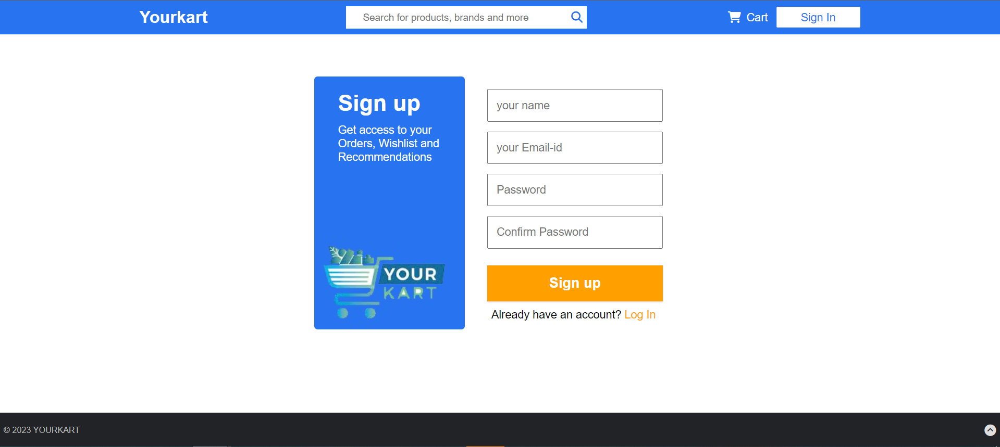
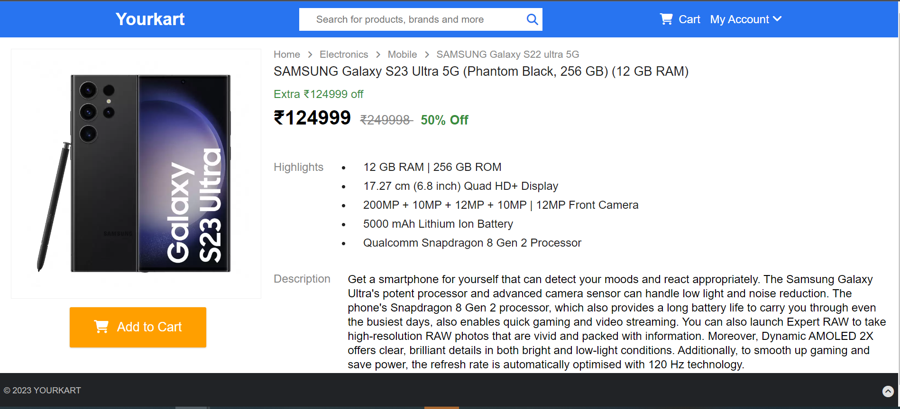
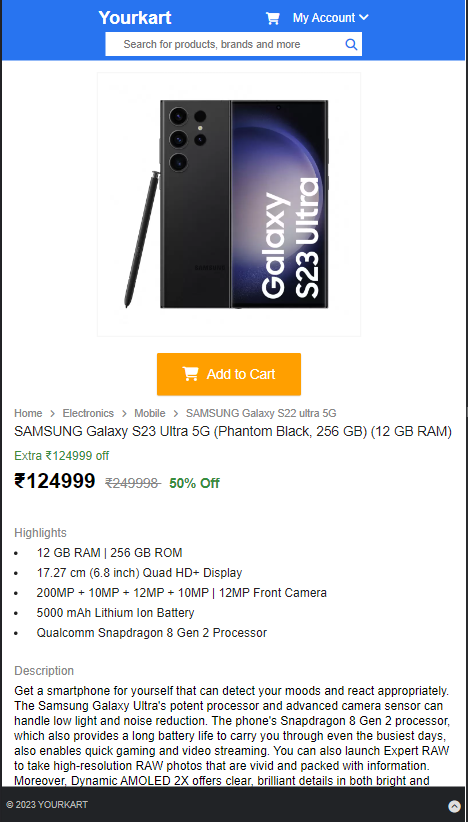
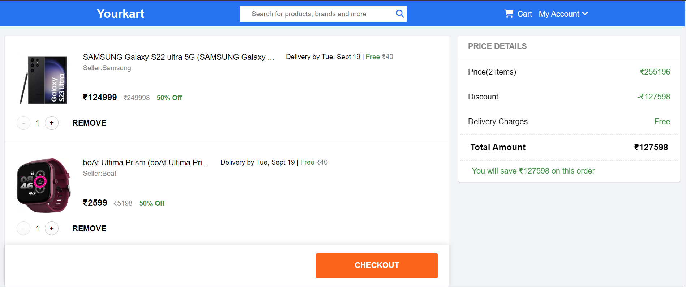
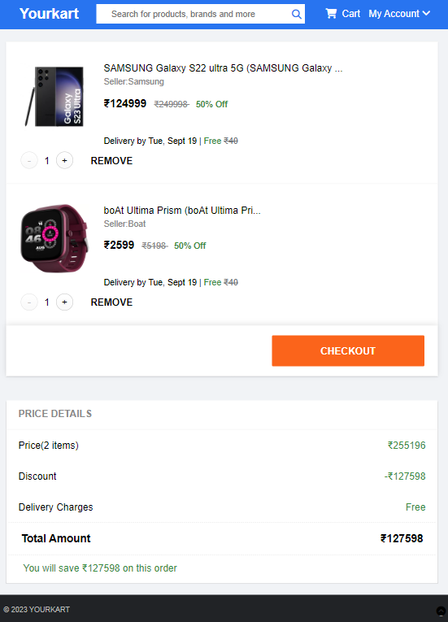
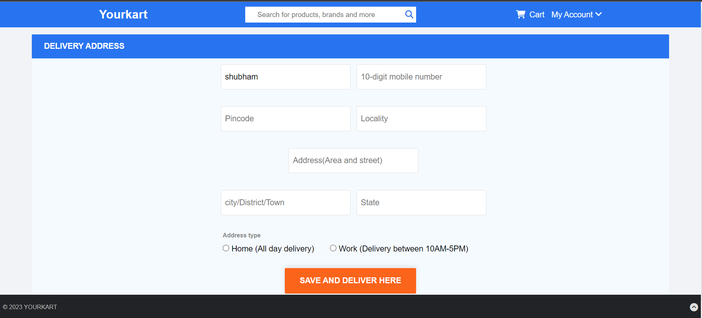
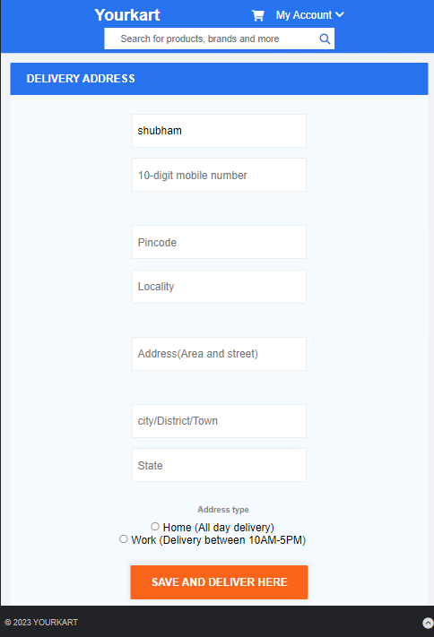

# YourKart - An E-Commerce website

## Description
In this website,users can login with their accounts,explore all the wonderful products,then choose the products they want to buy, add them to their cart and buy them.

## Screenshots

## Technologies Stack:

### Components
* HTML,CSS,Javascript,jQuery,Ajax,Sass
* Node.js,MongoDB,Express.js

## How to Install

* Clone the project onto your local machine.
* Then cd codeial
* npm install
* npm start
* Visit your app at http://localhost:8000.

